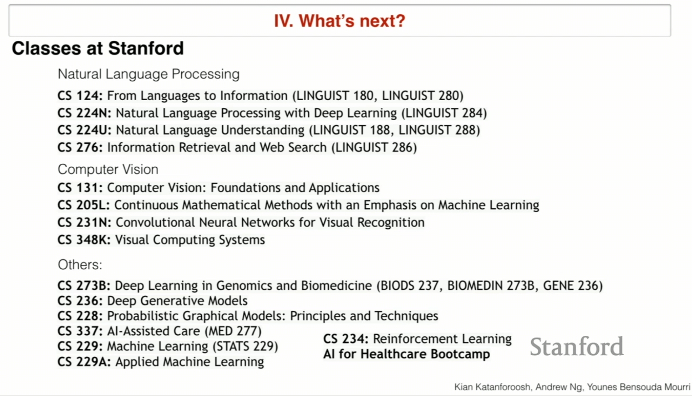

# Lecture 10

## Outline

1. Case Study: Conversational Assistant
2. Menti prize winners
3. Class projects
4. What's next?
5. Closing remarks

## Case study: Conversational Assistant

goal: build a chatbot to help students find and/or enroll in the right course

we only assume that students want info on classes or wants to enroll one. (for the sake of simplicity)

Utterance : user input

intent: denote the intention of the user. in this example enroll and inform

slots : slots are used to gather multiple information. slots are defined with intents, eg for enroll intent is code,year,quarter,SUid etc.  

turn : single turn means 1 utterance and one output and multiple turn for chatting back and forth. 

## How to detect intent

lstm or conv? both can do

2 class classification 

we can train a sequence classifier 

## How to detect slots

sequence to sequence problem. 

how to gather data? we can generate data with sentences that have blank spots for dates and quarter and ... . 

also can hand label and mechanical turk 

we can use transfer learning from the POS tagging online, 

## Some times we don't have all of the slots

chatbot should ask in the context to gather the information

we leverage attention with RNNs. why we do this? because some texts can have 2 slots at the same time

we can use knowledge graph and search in it

### How to evaluate the chatbots

we can divide into several parts and measure them but how about overall?

some research has been done in this area. they gathered a dataset of human labels that what response is more relevant. 

then train a model to evaluate chatbots.

we can compare two responses. 

### Vocal assistant

Speech to text and a text to speech. 

## Project advice

## What's next

look outside tech industry for problems that can be solved with AI

