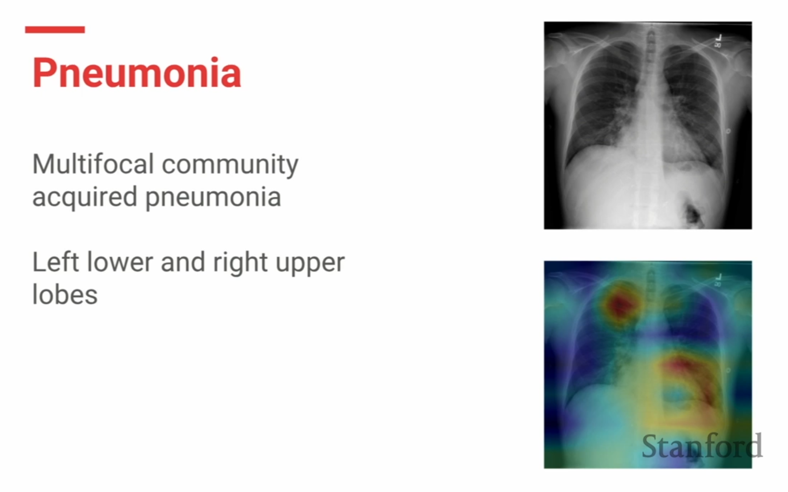
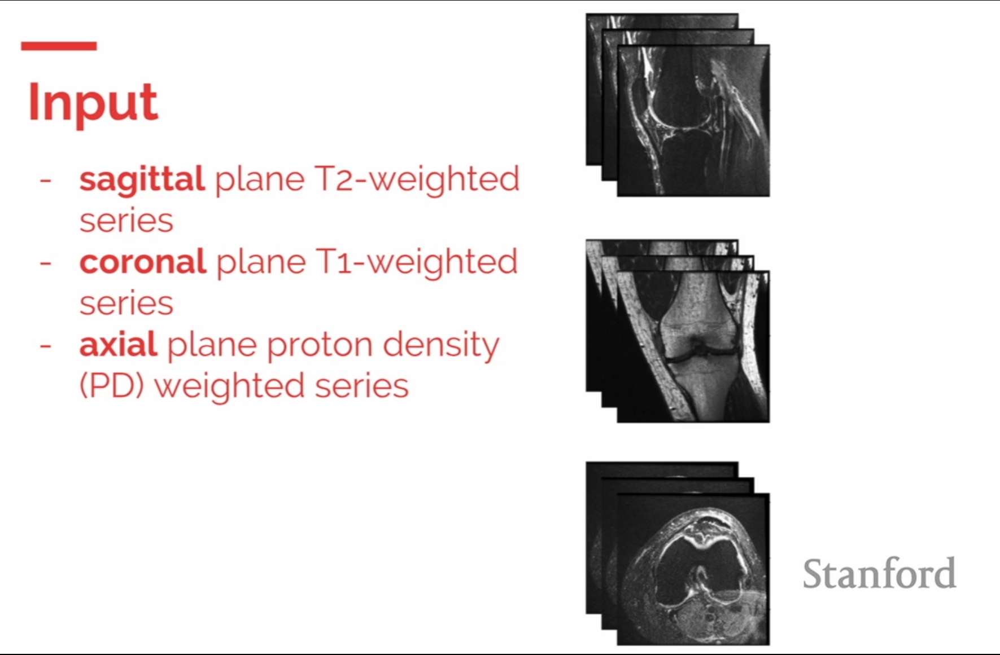
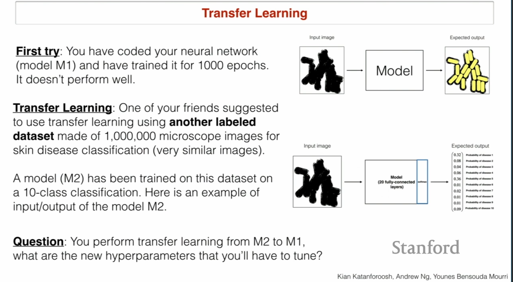
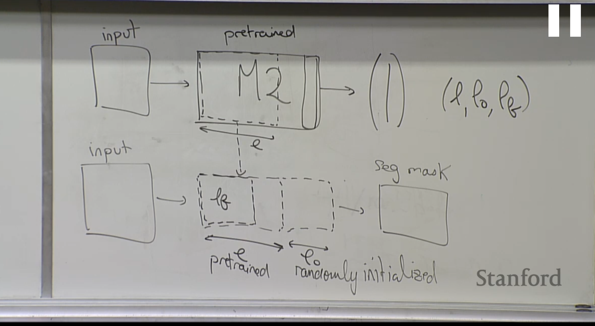
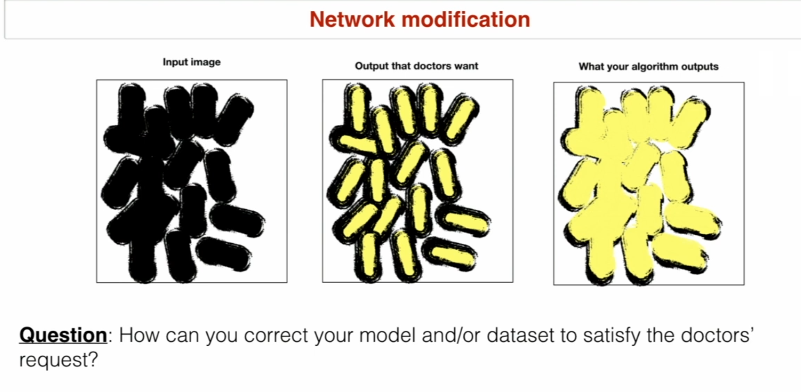

# Lecture 5 AI and Healthcare

## health care 

what questions can we ask?

1. descriptive 
2. diagnostic (why?)
3. predictive (what will happen?)
4. perspective (what should we do?)

## research

3 case studies 

### 1d ECG

arrhythmia detection in important. electrical activities of heart. Zio patch (up to 2 weeks = 1.6 billion heart beep) 

the burst of data will help automatic detection aps grow

#### challenges 

difficult to diagnose with single lead ECG (normally we do that with 12 leads)

differences are quite subtle in heart arrhythmia 

1d conv net over time dimension of input

#### conv net

residual nets(short cuts for very deep net)

#### data 

64 k ECG records (600x bigger than MIT-BIH)

#### Evaluation

surpass human level by 3 percent ! 

#### impact

continuously monitor patient 

apple watch 

### 2d chest x ray

detect pneumonia from chest x-rays pictures

2 billion per year images 

#### arch

- 2d CNN 224*224
- pretrained on image net
- 121 layer dense net 

dense net : connect all of the layers together (all have shortcut to each other)

#### dataset

112,120 frontal view x-ray 30k patient (largest Sep. 2017)

NLP systems that reads reports 

420 test set with Stanford x-ray expert

#### Evaluation

we don't have ground truth so we check them with each other and compute f1 score

Chex-net (435 and expert 395)

#### model interpretation 

Trust is an issue. class activation maps = ways of look at what part of images are imp to model. 

benefits of model

- improve healthcare delivery
- increase access to MRI 

### 3d MRI scan

#### input

#### output

multi label problem 

-  abnormality 
- ACL
- Meniscule 

#### data

1370 MRI exams

#### results

-  abnormality = 0.937
- ACL = 0.965
- Meniscule =0.847

#### generalizability 

external validation 

different scanner different country. and it did relatively well without training.

## how can be involved?

MURA = largest dataset for abnormality detection 

# Kian katan lecture ( case study of skin disease Cell segmentation)

## problem statement 

### goal

determine microscopic image correspond to image

segment images = classification of each pixels. 

we should have an mask at output. 

### data

100 k images: 

### question 

1. how to distribute this if C is the important data? 

   90 - 5 -5 where 5 - 5 all from C and some C are in Train Data 

2. image augmentation?
   crop - scale - blur - zoom - translate - H flip - random noise - changing contrast -  etc.

3. can image augmentation hurt an algorithm?

   Yes, in case of character recognition. 

(little case study: problem of car speech recognition when driving backward? mic was on the front and the sound was vague and they augmented vague data)

## transfer learning

## Network modification

We label like this (Cell , background, boundary)

for each use softmax of pix classes of y - > (0,0,1)

class unbalance will happen. and we use class weight ratio 

## new goal

binary classification . how to state why the model chose this answer? derivative of y^ in respect to x will show you a matrix of shape x. this matrix will have higher numbers in areas witch exchanging it's pixels will change the model's prediction. and lower numbers in areas witch changing it's pixels are making no difference. 

q : can we make 99% accuracy and human level performance is 97%. is it possible?

yes if we are competing with one doc and our knowledge is coming from a group of docs.