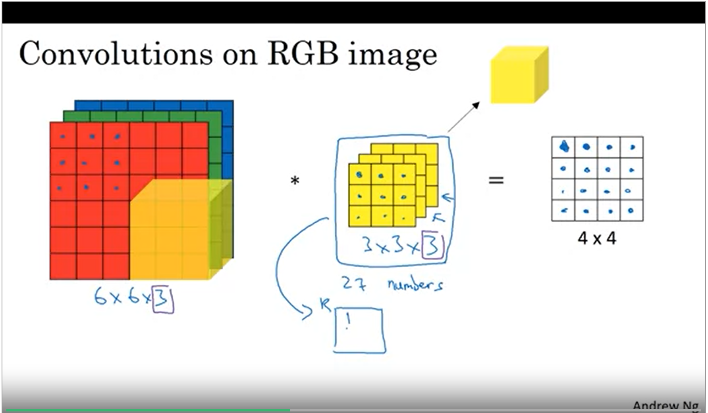

# Deep Learning Specialization Courses 3,4,5

[TOC]


## Structuring Machine learning projects

### week 1

#### Why strategy?

because there are a lot of parameters that we can determine, so we need a good strategy to find the best path to success 


#### Orthogonalization:

distribute controllers in angles (at 90 degree) 
good fit on train (if not good on this use bigger net, Adam , ... ) -> dev (if we didn't do well on dev use regularization, bigger train) - > test (use bigger dev set if test set accuracy is bad) -> real world (dev set and cost function) 
early stopping is not good

#### single number Evaluation Metric:
 f1 score = harmonic mean of precision and recall always use dev set 
average is not bad to use and gain insights. 

#### Satisficing and optimizing metric

how to combine accuracy and running time. using optimizing (maximize accuracy) and satisficing running time (time < 100 ms)

maximize accuracy and s.t. FP < 1 

#### Train Dev Test Distributions

dev aka hold out is used as a metric to find a good classifier hyper parameters and then we go and test our classifier on test set

random shuffle data from all the distribution 

" choose a dev set and test set to reflect data you expect to get in the future and consider important to do well on "

#### Size of the dev and test sets 

- old era with 100 examples 60/30/10. 
- new era = 98/1/1 (1 millions of data)
- better use test set 

#### When to change dev/test sets and metrics

When user choice is not consistent with your metric. 

- amend your metric if you are not satisfy with it or it's not in correspondence with user choices 

#### Why human-level performance?

1. advances of dl is competitive with human
2. workflow of learning is similar 

- Bayes optimal error in the optimal error. (aka Bayes Error).
- manual error analysis why did a person get this right
- better analysis of bias/variance

#### Avoidable bias


when huge gap between human and train error, focus on bias

when gap between train and dev error, focus on variance (avoidable bias between human and train error)

#### Understanding human-level performance

It depends on you application, maybe surpassing one doctor is enough for your application. maybe surpassing a group of 5 experienced doctors are good enough for you. 


#### Surpassing human-level performance

When you surpass human level, it's harder to enhance it. 

humans are good in natural tasks(vision, nlp, etc.)

for unnatural problems computers are really good and surpass human level performance. 

#### Improving your model performance

how much better you think you can do better on training set. 

-----

#### Andrej Karpathy interview

http://karpathy.github.io/2015/11/14/ai/

http://cs231n.stanford.edu/

http://karpathy.github.io/

____

### week2 

#### Carrying out error analysis

look at dev examples to evaluate ideas

**error analysis:**

- get 100 mislabeled dev set example
- count up how many are dogs

if a lot of dev images are mislabeled, we can improves it better. 

|   images   | blurry | dog  | cats |
| :--------: | ------ | ---- | ---- |
|     1      | x      |      |      |
|     2      |        |      | x    |
|     3      |        |      | x    |
| % of total | 8%     | 43%  | 61%  |

counting FP and FN

#### Cleaning up incorrectly labeled data

dl is robust to random errors but not robust to systematical errors. 


1. overall dev set error 10%
2. error due incorrect labels 0.6%
3. errors due to other causes 9.4%

goal of dev set is to choose better algorithms. 

- apply same process to dev and test set
- consider examining right labeled too.
- training can be come from slightly different distributions 

#### Build your first system quickly, then iterate

how to pick best direction to go?

1.  set up dev/test set and metric
2. build initial system
3. use Bias/Variance analysis and error analysis to prioritize next steps
4. (you can use academic literatures to get idea)

#### Training and testing on different distributions

hinger of el algo -> more data -> multiple distributions of data 

- [ ]  option 1: shuffle different distros of data and then split.
- [x] option2: train = web + app , dev = just app, test = just app

option 2 is better.

#### Bias and Variance with mismatched data distributions

we can not draw high bias/ variance conclusions when we don't have same distributions in train/dev.

use training-dev


#### Addressing data mismatch


artificial data synthesis can work well but we should try bigger synthetization to don't over fit. 

#### transfer Learning

pre training = use another models weights 

fine tuning= train some of weights 

- type of input must be same
- when transferring from a -> b we have lot data in task a 
- low level features from A could be helpful for learning B

#### Multi-task learning

having more than 1 label for data


#### What is end-to-end deep learning?


some times end to end works because of majority of data, but some times doesn't work. 

if you have lot of data for subtasks, you need to break your problem to subtasks. 

#### Whether to use end-to-end deep learning


## Convolutional Neural Networks

### Week 1

#### Computer Vision

Rapid advances are happening so fast that can use in applications 

and ideas of cv can be used in other areas

having large images(1000*1000 * 3 pixel = 1 Mega pixel) will make learnable parameters very plentiful. it's hard to train a neural network in computation wise. 

#### Edge detection Example

conv operation: basis of CNN.

vertical edges and horizontal image

filter aka kernel 

convolution = * 

element wise product 


```python
def conv_forward #Python
tf.nn.conv2d #Tensorflow
keras.layers.Conv2D # Keras
```

the middle kernel is an vertical kernel 


#### More Edge Detection


in deep learning we don't hand pick kernels and network will learn the kernel numbers as parameters.

#### Padding

 

6\*6 conv 3\*3  will make 4\*4 matrix where 4 is coming from 6-3+1 

padding = p = 1 => n+1\*n+1 

- Valid Conv = No padding
- same Conv = we pad so that output becomes the same shape of input size => $p=\frac{f-1}{2}$ as f is kernel dim
- we usually use odd numbers for f (kernel dim)

#### Strided Conv

this is the step of moving kernel. stride is s in below formula

$output dim ={\frac{n + 2*p - f}{s}+1}$


if output dim is not integer we use floor of output dim 


we don not compute that last operation if some of the kernel has gone out of the input.


in deep learning we call this conv operator. we don't flip on each dim. 

this should not effect your implementations

#### Convolutions Over Volume



(height, width, channels aka depth) channels must be same. 


#### One Layer of a Convolutional Network


#### Simple Convolutional Network Example


#### Pooling Layers

1. Max Pooling (returining max of the corresponing matrixes in dim of f \* f)
2. 